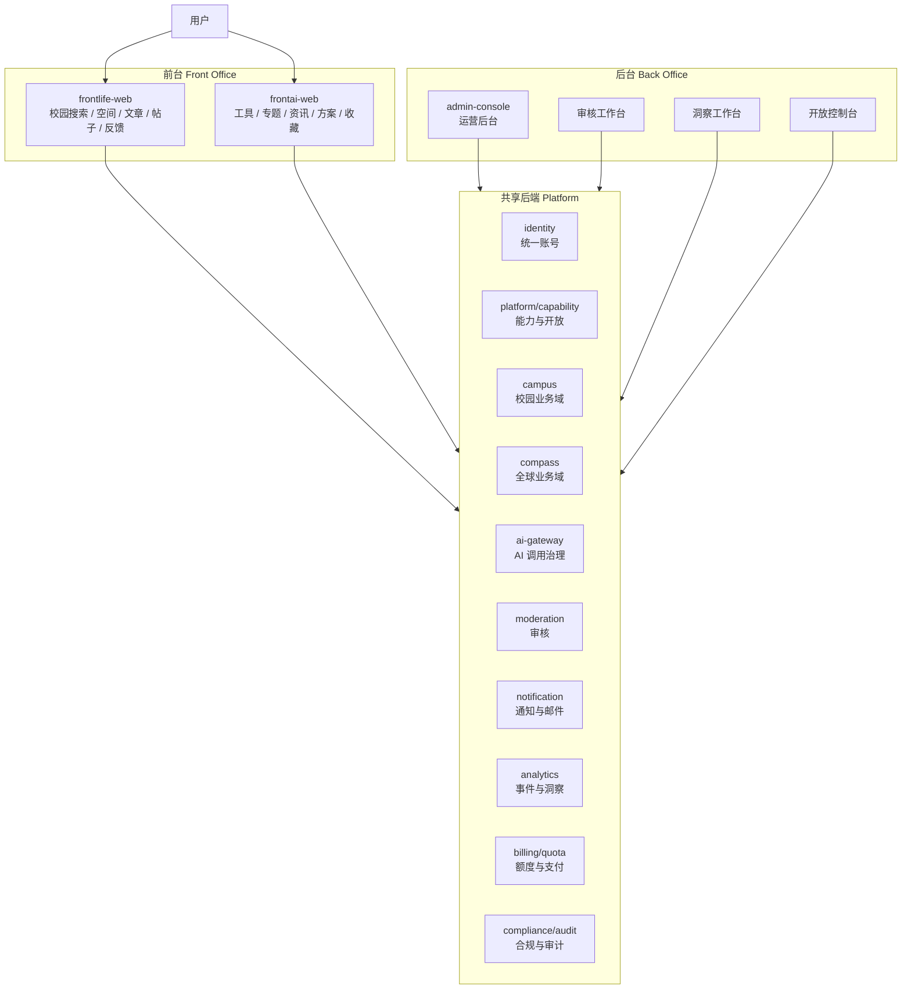

# 盘根架构设计

> 日期：2026-04-25
> 依据：`specs/MISSION.md`、`specs/PRD-盘根校园-v9.md`、`specs/PRD-盘根AI指南针-标准版.md`、`specs/最终全量实现方案.md`、`specs/盘根全量实现优先级与To-Do.md`
> 定位：盘根目标架构主文档。本文描述最终系统边界、模块职责、数据归属、接口分层和验收标准；具体执行顺序由 `specs/盘根全量实现优先级与To-Do.md` 承接。

## 0. 文档地位与裁定

本文是当前目标架构的主文档。后续产品、研发、后台、数据设计如果与本文冲突，以本文为准；如果本文与更高层的宪法、使命冲突，应先修订本文或上层文档，不允许在代码里用兼容分支掩盖冲突。

旧会议纪要、旧研发计划和旧架构研讨稿中出现的以下口径已废弃：

- 两站账号完全独立。
- 两站用户表完全不共享。
- 注册必须手机号/SMS。
- 注册必须邮箱。
- 全球站可以长期依赖 mock 登录、本地方案、本地收藏。
- 旧 `/api/spaces`、`/api/articles`、`/api/posts` 等路径可继续扩功能。

当前裁定：

- 账号身份统一。
- 账号级 LV / level 在后端共享。
- 校园 profile、全球 profile、知识库、方案、收藏和业务行为数据分离。
- 邮箱、手机号、GitHub OAuth 都是后置绑定或准入补充，不是早期主注册路径。
- 跨域 Cookie/token 不直接共享；统一认证服务通过站点上下文识别同一个 account。
- cn 原始个人数据不流向海外。
- 新能力走命名空间 API；旧路径只在迁移期保留，不新增功能。
- UI 图标统一 Lucide；emoji 只允许出现在用户输入文本中。

## 1. 一句话架构

盘根是一套 **统一账号与共享后端平台**，承载两个独立产品：

- 校园站 `frontlife-web`：可信校园知识网络。核心体验是 **搜一下，可信的**。
- 全球站 `frontai-web`：AI 实践方案生成器。核心体验是 **说一声，方案给你**。
- 共享后端 `server`：identity、capability、campus、compass、AI 网关、审核、通知、合规、数据、额度和审计。
- 后台 `admin-console`：运营、审核、配置、开放、洞察、报告和回滚控制台。
- 共享包 `@ns/shared`：纯 TypeScript 契约、类型、常量、敏感词与轻量校验。



## 2. 架构原则

1. **账号共享，产品分开**
   同一个 account 可以进入两站，账号级 level 共享；校园 profile 和全球 profile 分离，业务数据不默认互通。

2. **后端共享，领域隔离**
   后端是一套平台能力，但 campus 和 compass 是两个业务域。跨域调用必须通过明确 service/API，不允许直接混用表和对象。

3. **AI 受控，不替人决策**
   AI 可以生成搜索参考、方案草稿、摘要、洞察和建议；不能自动发布、自动精选、自动下架、自动改变产品规则。

4. **本地可信内容优先**
   校园站搜索必须本地可信内容优先。AI 是兜底和辅助，不能伪造校园事实。

5. **目标优先，不强迫选工具**
   全球站方案页必须允许用户先输入目标；工具选择是推荐和辅助，不是进入方案页的门槛。

6. **能力后端裁决**
   前端不直接写死等级到权限的映射。前端读取 `/api/platform/capabilities?site=campus|compass`。

7. **全量开发，分级开放**
   功能可以完整实现，但上线使用由 feature flag、capability、quota、launch preset 和后台开关控制。

8. **不写长期兼容层**
   旧接口只在迁移期保留。新功能只进入命名空间接口，迁移完成后删除旧路径。

9. **数据最小化和可审计**
   收集最少必要数据；高权限操作、准入、额度、同步、删除、AI 调用必须可审计。

## 3. 代码仓库结构

当前目标结构：

```text
NorthStar/
├─ packages/
│  ├─ frontlife-web/      校园站前端
│  ├─ frontai-web/        全球站前端
│  ├─ admin-console/      统一后台
│  ├─ server/             共享后端
│  └─ shared/             纯 TypeScript 契约与工具
└─ specs/                 产品、架构、计划文档
```

### 3.1 `@ns/shared`

职责：

- API request / response 类型。
- 领域枚举和常量。
- Zod 或轻量校验。
- 敏感词输入/输出工具。
- 站点与 envelope 类型。
- seed 数据中可复用的纯数据。

禁止：

- React。
- Zustand。
- DOM API。
- UI 组件。
- 路由。
- 服务端数据库 client。

契约优先级：

```text
shared contract -> server implementation -> frontend client -> UI
```

凡是涉及跨包请求/响应的改动，先改 `shared`，再改 server，再改前端。

### 3.2 `server`

目标分层：

```text
server/src
├─ app.ts                 Hono 应用、CORS、siteMiddleware、模块挂载
├─ index.ts               Node.js 进程入口、后台 cron 任务
├─ db/                    schema、client、site-aware helper
├─ middleware/            auth、site context、error envelope
├─ lib/                   通用服务端工具
├─ modules/
│  ├─ identity/           统一账号、凭证、profile
│  ├─ platform/           capability、feature flag、launch config
│  ├─ campus/             校园空间、文章、帖子、搜索、反馈
│  ├─ compass/            工具、专题、文章、资讯、方案
│  ├─ ai-gateway/         AI provider、敏感词、quota、fallback、日志
│  ├─ moderation/         审核任务、状态机、审计
│  ├─ notification/       站内通知、邮件 provider、投递记录
│  ├─ analytics/          行为事件、指标、洞察
│  ├─ billing/            quota、ledger、payment order
│  ├─ compliance/         协议、隐私、导出、删除、注销
│  └─ insights/           搜索缺口、内容质量、AI 成本洞察
└─ scripts/               seed、索引刷新、清理、扫描任务
```

模块内部推荐形态：

```text
repository.ts   只负责数据读写
service.ts      负责业务规则和跨模块编排
routes.ts       负责 HTTP 入参、鉴权、返回 envelope
types.ts        负责模块内部类型，不替代 shared contract
```

### 3.3 `frontlife-web`

职责：

- 校园站 6 页信息架构。
- 搜索、本地内容、AI 参考、求助、空间、文章、帖子、反馈。
- 移动端优先，底栏：首页 / 探索 / 我的。

页面边界：

```text
/                 首页
/search           搜索结果
/explore          探索页
/space/:id        空间页
/article/:id      文章阅读页
/me               我的
/login            登录
/legal/*          协议和隐私
```

不新增主页面：

- 帖子详情。
- 写作页。
- 通知详情页。
- 空间认领详情页。

这些用 overlay、抽屉或当前页面内嵌面板承载。

### 3.4 `frontai-web`

职责：

- 全球站工具、专题、文章、资讯、方案和用户中心。
- `/solution/new` 目标优先，不要求先选工具。
- 移动端底栏：首页 / 方案 / 我的。

页面边界：

```text
/                         首页
/tool/:toolId             工具详情
/article/:articleId       文章阅读
/solution/new             新建方案
/solution/:solutionId     方案详情
/me/*                     用户中心
/login                    登录 / 准入
```

原型期 mock 登录、本地方案、本地收藏、本地工具/文章数据都只能作为迁移前状态，不能作为最终主路径。

### 3.5 `admin-console`

职责：

- 审核、用户、内容、配置、审计、洞察、额度、通知、合规处理。
- 所有高权限操作写 audit。
- 站点切换必须影响数据范围，不只是 UI 文案。

原则：

- 不显示假数据冒充真实数据。
- 尚未实现的能力显示 Locked 态和缺失依赖。
- placeholder 必须有 owner、用途、删除条件；最终 P6 删除。

## 4. 前台产品架构

### 4.1 校园站 `frontlife-web`

目标：让学生和老师快速得到可信校园答案，并把信息沉淀为空间。

核心能力：

- 搜索校园问题。
- 本地内容优先。
- AI 参考回答作为搜索的一部分，但受额度和敏感词控制。
- 空间、文章、帖子、回复。
- 有帮助、有变化、求助。
- 我的内容、我的收藏、我的空间、帮助人数。
- 低权重自然进入全球站的触点。

搜索三态：

| 状态 | 展示顺序 | AI 边界 | 用户下一步 |
| --- | --- | --- | --- |
| 精确匹配 | 本地文章/空间/帖子优先，AI 折叠 | 只做补充摘要 | 阅读、收藏、有帮助 |
| 部分匹配 | 本地结果在前，AI 作为补充 | 标注参考 | 继续搜索、补充信息 |
| 无匹配 | AI 参考建议 + 相关内容 + 求助入口 | 不编造校园事实 | 发起求助、补充准确信息 |

校园站不做：

- 首页强推广全球站。
- 搜索输入过程打断用户。
- 用点赞替代“有帮助”。
- 文章评论区。
- 粉丝/关注。
- 在前台暴露 LV1/LV2/LV3 标签。

说明：level 是后端权限和运营规则，不是校园站前台用户心智。校园站前台只展示贡献、能力结果和自然信任信号。

### 4.2 全球站 `frontai-web`

目标：帮助用户围绕目标生成可执行 AI 实践方案。

核心能力：

- 工具发现。
- 专题、文章、资讯。
- 目标输入。
- 工具推荐。
- AI 方案生成。
- 方案保存、详情、导出、反馈。
- 收藏工具和文章。
- 用户中心、额度、设置。

方案页规则：

- `/solution/new` 永远可进入。
- 用户可以不选工具，直接输入目标。
- 有已选工具时，作为上下文参与方案生成。
- 无工具时，系统推荐候选工具，用户可接受、调整或跳过。
- 额度不足时进入 Locked 或 Degraded 态。
- AI 结果明确标注。

全球站不做：

- 把工具目录当核心终点。
- 长期使用本地方案作为资产库。
- 未登录也保存私有方案。
- 从校园站带 token 或个人身份进入全球站。

## 5. 中台模块架构

### 5.1 Identity

职责：

- account。
- credentials。
- campus profile。
- compass profile。
- token/session。
- email/password reset。
- OAuth binding。
- level change log。

目标模型：

```text
Account
- id
- username
- globalLevel
- status
- createdAt
- updatedAt

Credential
- accountId
- type: password / email / phone / github
- identifierHash
- secretHash
- verifiedAt
- createdAt

CampusProfile
- accountId
- displayName
- school
- contributionStats
- createdAt
- updatedAt

CompassProfile
- accountId
- applicationStatus
- quotaProfile
- savedSolutionStats
- favoriteStats
- createdAt
- updatedAt

LevelChangeLog
- accountId
- fromLevel
- toLevel
- reason
- operatorId
- createdAt
```

早期注册：

```text
用户名 + 密码
```

后置绑定：

- 邮箱。
- 手机号。
- GitHub OAuth。
- 校园认证。

手机号/SMS 不作为早期注册主路径。

### 5.2 Platform / Capability

职责：

- 站点能力映射。
- feature flag。
- launch preset。
- quota summary。
- Locked / Degraded / Hidden 状态。

核心接口：

```http
GET /api/platform/capabilities?site=campus
GET /api/platform/capabilities?site=compass
GET /api/platform/feature-flags?site=campus|compass
```

能力返回原则：

- 返回前端需要的具体能力，不要求前端理解等级策略。
- 返回剩余额度和 lockedReason。
- 返回中文可展示原因时，仍保留机器可读 code。

campus 能力示例：

```json
{
  "site": "campus",
  "canSearch": true,
  "canUseAiSearch": true,
  "aiSearchRemaining": 3,
  "canPost": true,
  "canWriteArticle": false,
  "canCreateSpace": false,
  "lockedReason": null
}
```

compass 能力示例：

```json
{
  "site": "compass",
  "canGenerateSolution": true,
  "canSaveSolution": false,
  "canExportSolution": false,
  "canSubmitContent": false,
  "solutionRemaining": 2,
  "lockedReason": "当前账号暂未开放方案保存"
}
```

### 5.3 Campus Domain

职责：

- spaces。
- articles。
- posts。
- replies。
- feedbacks。
- favorites。
- claims。
- campus search。
- search gaps。

当前实现模型（以 `server/src/db/schema.ts` 为准）：

```text
knowledgeBases
- id
- slug
- title
- description
- ownerId
- category
- cover
- isClaimed
- claimedBy
- articleCount
- favoriteCount
- createdAt
- updatedAt

articles
- id
- kbId
- parentId
- title
- slug
- content
- toc
- cover
- authorId
- status
- confirmedAt
- helpfulCount
- changedCount
- readCount
- favoriteCount
- sortOrder
- createdAt
- updatedAt

posts
- id
- kbId
- title
- content
- tags
- authorId
- replyCount
- solved
- readCount
- favoriteCount
- createdAt
- updatedAt

feedbacks
- id
- targetType
- targetId
- userId
- type: helpful / changed
- changedNote
- createdAt
```

关键规则：

- 空间是知识容器，不是普通论坛板块。
- 文章承担长期可信信息。
- 帖子承担短问题、求助、动态。
- 有帮助是正向信任信号。
- 有变化是公开维护信号，不能藏在后台。
- 90 天无人维护可触发空间认领任务。

### 5.4 Compass Domain

职责：

- tools。
- topics。
- articles。
- news。
- solutions。
- favorites。
- search。
- content studio。

内容模型建议先统一：

```text
ContentRecord
- id
- site: compass
- contentType: tool / topic / article / news
- slug
- title
- summary
- body
- metadata
- status: draft / pending / published / rejected / archived
- ownerAccountId
- publishedAt
- createdAt
- updatedAt

ContentVersion
- id
- contentRecordId
- version
- snapshot
- editorAccountId
- createdAt
```

方案模型：

```text
Solution
- id
- accountId
- title
- targetGoal
- toolIds
- content
- mode: ai / demo
- fallbackReason
- visibility
- createdAt
- updatedAt

SolutionFeedback
- solutionId
- accountId
- value: useful / not_useful
- note
- createdAt

SolutionExport
- solutionId
- accountId
- format: md / txt / csv
- createdAt
```

关键规则：

- 发布内容必须审核。
- 工具、专题、文章、资讯都服务“目标 -> 方案”。
- 方案属于用户资产，不能只存在 localStorage。
- 方案反馈进入 analytics 和内容改进信号。

### 5.5 AI Gateway

AI 网关是唯一模型调用入口。

职责：

- 输入敏感词检查。
- 本地搜索优先。
- capability 检查。
- quota 检查。
- prompt 组装。
- provider 调用。
- 输出过滤。
- fallback reason 标准化。
- token、成本、耗时记录。
- 调用日志审计。
- AI 输出抽检进入 moderation。

核心流程：

```text
request
-> site context
-> auth optional/required
-> sensitive input check
-> capability check
-> quota check
-> local retrieval if needed
-> provider call or demo fallback
-> sensitive output check
-> log usage
-> return envelope
```

无 key 策略：

- 不白屏。
- 不假装真实 AI 成功。
- 返回 `mode: "demo"`。
- 返回清晰 `fallbackReason`。
- 前端用中文说明降级原因。

### 5.6 Moderation

职责：

- 举报。
- 内容发布审核。
- 有变化处理。
- 空间认领。
- 申请制准入。
- AI 输出抽检。
- 删除/注销处理。

任务模型：

```text
ModerationTask
- id
- site
- taskType
- targetType
- targetId
- status: pending / approved / rejected / resolved / cancelled
- priority
- payload
- reporterAccountId
- assigneeAccountId
- createdAt
- updatedAt
```

规则：

- task payload 存必要上下文，不复制大段正文。
- 审核动作必须写 audit。
- 重复 pending task 要有去重规则。
- 驳回需要内部原因和可展示原因分离。

### 5.7 Notification / Email

职责：

- 站内通知。
- 邮件 provider。
- 投递记录。
- 失败重试。

校园站通知类型：

- `auth_invite`
- `feedback`
- `changed`
- `expiry`
- `claim`
- `reply`

全球站通知类型：

- application result。
- invite code。
- solution feedback。
- content review result。
- quota/billing notice。

规则：

- 站内通知走 `/api/notification/*`。
- 邮件失败可查、可重试。
- dev provider 写投递记录，不依赖真实邮件服务。
- 邮件内容中文优先，不暴露内部审核备注。

### 5.8 Analytics / Insight

职责：

- behavior events。
- 指标聚合。
- 需求洞察。
- 内容质量报告。
- 90 天清理。

事件白名单：

- 搜索。
- 无结果。
- AI 兜底。
- 有帮助。
- 有变化。
- 发帖。
- 回复。
- 空间访问。
- 文章阅读。
- 方案生成。
- 方案保存。
- 方案反馈。
- 工具点击。
- 收藏。
- 跨站点击。

边界：

- 匿名用户只存聚合所需最小数据。
- 登录用户只存产品闭环所需最小事件。
- 跨站转化只记录来源域名/渠道，不传递身份。
- 行为数据默认 90 天清理。
- 洞察只生成建议，不直接改前台。

### 5.9 Billing / Quota

职责：

- quota。
- quota ledger。
- payment orders。
- 手动确认支付。
- 后续 provider 接入。

规则：

- AI 调用扣减只在后端发生。
- 前端不能提交扣减数。
- 额度不足返回 Locked 或 Degraded。
- admin 可查看订单、额度调整、扣减记录。
- 额度调整写 audit。

### 5.10 Compliance / Audit

职责：

- 协议。
- 隐私。
- consent。
- 数据导出。
- 数据删除。
- 注销申请。
- 审计日志。

规则：

- 数据导出只返回本人数据。
- 删除/注销可申请、可审计、可验证。
- token invalidation 必须覆盖注销和敏感操作。
- GDPR/PIPL 相关路径不算完成，直到有异步删除、删除审计和专项验证。

## 6. API 分层

最终命名空间：

```text
/api/identity/*
/api/platform/*
/api/campus/*
/api/compass/*
/api/ai-gateway/*
/api/analytics/*
/api/insights/*
/api/moderation/*
/api/notification/*
/api/compliance/*
/api/admin/*
```

### 6.1 前台调用规则

校园站：

- 主要调用 `/api/campus/*`。
- 登录、me 调用 `/api/identity/*`。
- 能力调用 `/api/platform/capabilities?site=campus`。
- AI 只通过后端 `/api/ai-gateway/chat` 或 campus service 间接调用。

全球站：

- 主要调用 `/api/compass/*`。
- 登录、me 调用 `/api/identity/*`。
- 能力调用 `/api/platform/capabilities?site=compass`。
- AI 只通过后端 `/api/ai-gateway/chat` 或 compass service 间接调用。

后台：

- 主要调用 `/api/admin/*`、`/api/moderation/*`、`/api/analytics/*`、`/api/compliance/*`。
- 所有高权限操作必须带 auth 和 audit。

### 6.2 旧路径迁移规则

旧路径迁移目标：

```text
/api/spaces        -> /api/campus/spaces
/api/articles      -> /api/campus/articles
/api/posts         -> /api/campus/posts
/api/feed          -> /api/campus/feed
/api/search        -> /api/campus/search
/api/me            -> /api/campus/me 或 /api/platform/capabilities
/api/favorites     -> /api/campus/favorites
/api/notifications -> /api/notification/*
```

删除门槛：

- 新接口已经覆盖。
- 前端已经切换。
- server 测试或 smoke 已覆盖。
- 全仓搜索确认没有页面依赖。
- 旧路径没有新增功能。

## 7. 数据共享边界

### 7.1 共享

- account 身份。
- 账号级 level。
- 统一登录能力。
- feature flag。
- capability 策略。
- quota 策略。
- AI 网关能力。
- 审核能力。
- 通知能力。
- 脱敏行为事件。
- 聚合需求洞察。

### 7.2 不默认共享

- 校园知识库。
- 全球工具知识库。
- 校园 profile。
- 全球 profile。
- 校园个人行为明细。
- 全球方案详情。
- 全球收藏。
- 个人搜索记录。
- 跨域 Cookie/token。
- 手机号、邮箱等身份信息。

### 7.3 有限同步

允许：

- cn -> com 单向。
- 已公开。
- 已审核。
- 去个人化。
- 必要时作者授权。
- 作为全球站案例或内容素材。

禁止：

- com -> cn 自动内容同步。
- 用全球站内容自动改校园站推荐。
- 把校园个人数据用于全球站个性化。
- 把用户原始隐私数据直接交给 AI 分析。

同步必须：

- 支持 dry-run。
- 写 audit。
- 标记来源和更新时间。
- 可回滚或可删除。

## 8. 核心业务流

### 8.1 校园搜索闭环

```text
用户搜索
-> campus search 本地检索
-> 有足够可信结果：返回本地内容
-> 结果不足：检查 capability / quota / sensitive
-> AI 生成参考回答或进入 fallback
-> 标注“由 AI 生成，仅供参考”
-> 用户点击文章、空间、发起求助或补充准确信息
-> 有帮助 / 有变化 / 求助进入校园反馈系统
-> 行为进入 analytics
-> insight 聚类高频缺口
-> 后台创建内容任务或通知维护者
```

### 8.2 校园空间维护闭环

```text
空间内容被阅读
-> 用户点击有帮助
-> confirmationCount 增加
-> 用户点击有变化
-> 生成公开变化标记和 moderation task
-> 审核通过后通知维护者
-> 维护者更新内容
-> 文章更新时间和确认时间刷新
-> 变化标记解除
```

### 8.3 空间认领闭环

```text
扫描长期无人维护空间
-> 满足 90 天规则
-> 创建 space_claim moderation task
-> 通知候选人或管理员
-> 后台审核
-> 通过：更新 owner / maintainer，写 audit
-> 驳回：保留审核记录，不改 owner
```

### 8.4 全球方案闭环

```text
用户进入 /solution/new
-> 输入目标
-> 可选选择工具
-> 无工具时推荐候选工具
-> 检查 capability / quota / sensitive
-> AI 生成方案或 demo fallback
-> 用户保存方案
-> 进入 /solution/:solutionId
-> 用户导出或反馈有用/没用
-> 方案保存率和有效率进入 analytics
-> 没用反馈触发内容改进信号
```

### 8.5 跨站自然转化

```text
校园站 AI 回答卡片
-> 低权重“由 AI 生成”说明
-> 低权重链接：想了解更多 AI 工具？
-> 新标签页打开全球站
-> 只记录聚合来源
-> 不传 token
-> 不传个人身份
```

允许触点：

- 校园站 AI 回答卡片。
- 校园站文章阅读完成后。
- 校园站中用户主动讨论 AI 工具时的内容关联。

禁止触点：

- 首页强推广。
- 搜索输入过程打断。
- com 内容自动反向灌入 cn。
- 携带跨站登录态。

## 9. 后台架构

后台不是普通 CRUD，而是控制系统。

模块：

- 用户管理。
- 站点 profile 查看。
- 校园空间与内容管理。
- 全球工具、专题、资讯、文章管理。
- 审核队列。
- 举报处理。
- AI 输出抽检。
- AI 调用、额度、成本控制。
- 功能开放控制台。
- 通知投递。
- 需求洞察工作台。
- 内容质量报告。
- 数据中心（洞察、质量、AI 成本等）。
- 合规处理：协议、隐私、数据导出、注销。
- 审计日志。

开放状态：

```text
Hidden     入口不可见
Locked     入口可见但不可用，给出解释
Degraded   功能可用但范围、质量或额度降低
Enabled    功能完整开放
```

开放前依赖检查示例：

- 开放游客 AI 搜索前，必须有 AI 网关、敏感词、游客额度、调用日志、fallback 文案、成本上限。
- 开放全球方案保存前，必须有 identity、capability、solutions 表、用户中心入口、私有数据鉴权。
- 开放内容投稿前，必须有 moderation、content versions、审核通知、audit。
- 开放支付前，必须有 quota ledger、payment orders、手动确认或 provider、退款/失败态说明。

## 10. 部署与数据驻留

早期面向国内用户并使用国内服务器时：

- 数据存储在国内。
- 不收手机号、实名、身份证、学号。
- 注册最小化。
- AI 需求分析只读脱敏事件和聚合指标。
- 不把 cn 原始用户数据发到海外。

未来全球站海外化时，架构应支持：

```text
cn operational db
com operational db
shared platform config
regional identity mapping
event aggregation with boundary
derived insight without raw identity
```

逻辑上统一 account，物理上允许按区域拆 identity store 和 product profile。跨区域同步只同步必要、脱敏、授权或公开数据。

## 11. 安全与合规边界

必须满足：

- 前端构建产物不得包含任何 AI/API key。
- token 必须有过期和失效机制。
- cn/com 私有数据访问必须 site-aware。
- 数据导出只能导出本人数据。
- 注销/删除必须让旧 token 失效。
- 高权限操作写 audit。
- AI 输入敏感词拦截。
- AI 输出敏感词过滤或降级。
- 邮件失败可查、可重试。
- 额度扣减只在后端发生。

禁止：

- 前端直接调用真实模型 provider。
- 前端提交额度扣减数。
- 用 localStorage 作为最终用户资产库。
- 用 mock 数据冒充生产数据。
- 将校园个人行为明细用于全球个性化。
- AI 自动发布或自动精选。

## 12. 验收标准

### 12.1 产品验收

校园站：

- 用户能搜索校园问题。
- 本地可信内容优先。
- 无结果能转求助。
- 用户能点“有帮助”。
- 用户能点“有变化”。
- 空间能沉淀文章和动态。
- 我的页能看到贡献和收藏。
- 移动端底部导航是：首页 / 探索 / 我的。

全球站：

- 用户不选工具也能进入方案页。
- 用户输入目标后能生成方案。
- 用户能保存、查看、导出、反馈方案。
- 工具能加入方案。
- 收藏、额度、设置在用户中心可用。
- 移动端底部导航是：首页 / 方案 / 我的。

平台：

- 同一账号能识别为同一个 account。
- 两站 profile 分离。
- 两站业务数据不混用。
- 权限由 capability 返回。
- AI 额度受控。
- 敏感词输入拦截和输出过滤存在。
- AI key 不进入前端产物。

后台：

- 能审核内容、举报、AI 输出和准入申请。
- 能管理校园空间和全球内容。
- 能查看 AI 调用成本。
- 能控制 feature flag。
- 能查看洞察和生成脱敏报告。
- 所有高权限操作写审计日志。

### 12.2 技术验收

基础命令：

```bash
cd NorthStar/packages/shared && npx tsc --noEmit
cd NorthStar/packages/server && npx tsc --noEmit
cd NorthStar/packages/server && pnpm test
cd NorthStar/packages/frontlife-web && npx tsc --noEmit
cd NorthStar/packages/frontlife-web && pnpm test
cd NorthStar/packages/frontlife-web && pnpm build
cd NorthStar/packages/frontai-web && npx tsc --noEmit
cd NorthStar/packages/frontai-web && pnpm build
cd NorthStar/packages/admin-console && pnpm typecheck
cd NorthStar/packages/admin-console && pnpm build
```

涉及 DB 的切片额外跑：

```bash
cd NorthStar/packages/server && pnpm db:push
cd NorthStar/packages/server && pnpm db:seed
cd NorthStar/packages/server && pnpm search:refresh
```

专项 smoke：

- 校园真实 API smoke。
- 全球真实 API smoke。
- admin smoke。
- cn/com 数据隔离。
- 无 AI key fallback。
- 额度不足。
- 失效 token。
- 空数据态。
- 断 server。
- 行为数据 90 天清理。
- 数据导出与删除。

## 13. 与 To-Do 的对应关系

| 架构能力 | 执行落点 |
| --- | --- |
| 文档冲突修订 | P0 |
| 统一账号与 credentials | P1 |
| capability API | P1 |
| 最小 AI 限流和 fallback | P1 |
| 校园搜索三态与求助 | P2 |
| 校园通知 6 类型 | P2 |
| 空间认领 | P2 |
| 校园 6 页和创作交互 | P2 |
| 全球真实登录、申请、邀请码、OAuth | P3 |
| 全球内容模型和 API | P3 |
| admin 内容管理去 placeholder | P3 |
| 目标优先方案页 | P4 |
| 方案保存、详情、导出、反馈 | P4 |
| AI 网关完整版 | P5 |
| Analytics、洞察、报告 | P5 |
| Notification / Email | P5 |
| Billing / Quota | P5 |
| 旧路径、mock、placeholder 删除 | P6 |
| 全量验证、文档、发布 | P7 |

## 14. 最终结论

1. 盘根不是一个大站拆成两个页面，而是两个产品共享一个平台。
2. 前台分产品，中台分能力，后台分工作台。
3. 账号和账号级 level 共享，但校园 profile、全球 profile 和业务数据分开。
4. 校园站是可信校园知识网络，不是 AI 展示页。
5. 全球站是 AI 实践方案生成器，不是工具目录。
6. AI 搜索和方案生成都必须受后端网关、敏感词、额度和日志治理。
7. 功能开放不是写死阶段，而是后台按钮和中台策略共同控制。
8. 需求分析和学校报告属于中台和后台，不进入校园前台。
9. 旧路径、mock、placeholder 必须迁移后删除，不能长期并存。
10. 架构完成的判断标准不是“页面能点”，而是账号、数据、权限、AI、审核、通知、合规、审计都能闭环。
